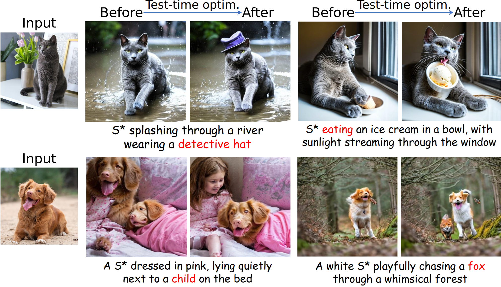

# CoRe: Context-Regularized Text Embedding Learning for Text-to-Image Personalization
> Recent advances in text-to-image personalization have enabled high-quality and controllable image synthesis for user-provided concepts. However, existing methods still struggle to balance identity preservation with text alignment. Our approach is based on the fact that generating prompt-aligned images requires a precise semantic understanding of the prompt, which involves accurately processing the interactions between the new concept and its surrounding context tokens within the CLIP text encoder. To address this, we aim to embed the new concept properly into the input embedding space of the text encoder, allowing for seamless integration with existing tokens. We introduce Context Regularization (CoRe), which enhances the learning of the new concept's text embedding by regularizing its context tokens in the prompt. This is based on the insight that appropriate output vectors of the text encoder for the context tokens can only be achieved if the new concept's text embedding is correctly learned. CoRe can be applied to arbitrary prompts without requiring the generation of corresponding images, thus improving the generalization of the learned text embedding.
> Additionally, CoRe can serve as a test-time optimization technique to further enhance the generations for specific prompts. Comprehensive experiments demonstrate that our method outperforms several baseline methods in both identity preservation and text alignment.


## Update
-  **2024.11.28**: repository released!

### Test-time optimization

You can also use Test-time optimization to fine-tune a specific prompt.


## Acknowledgements

This project builds upon the work of several other repositories. We would like to express our gratitude to the following projects for their contributions:

- [Diffusers-Textual Inversion](https://github.com/huggingface/diffusers/tree/main/examples/textual_inversion): A implementation of An Image is Worth One Word: Personalizing Text-to-Image Generation using Textual Inversion
- [Dreambooth-Stable-Diffusion](https://github.com/XavierXiao/Dreambooth-Stable-Diffusion): Implementation of Dreambooth (https://arxiv.org/abs/2208.12242) with Stable Diffusion
- [Diffusers](https://github.com/huggingface/diffusers): A library for state-of-the-art pretrained diffusion models.
---

## References

```
@article{wu2024core,
  title={CoRe: Context-Regularized Text Embedding Learning for Text-to-Image Personalization},
  author={Wu, Feize and Pang, Yun and Zhang, Junyi and Pang, Lianyu and Yin, Jian and Zhao, Baoquan and Li, Qing and Mao, Xudong},
  journal={arXiv preprint arXiv:2408.15914},
  year={2024}
}
···
